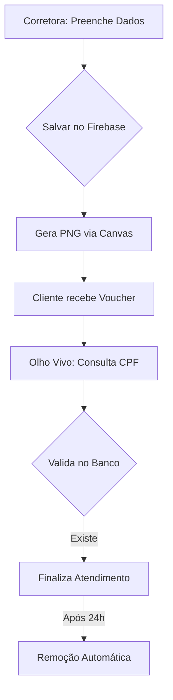
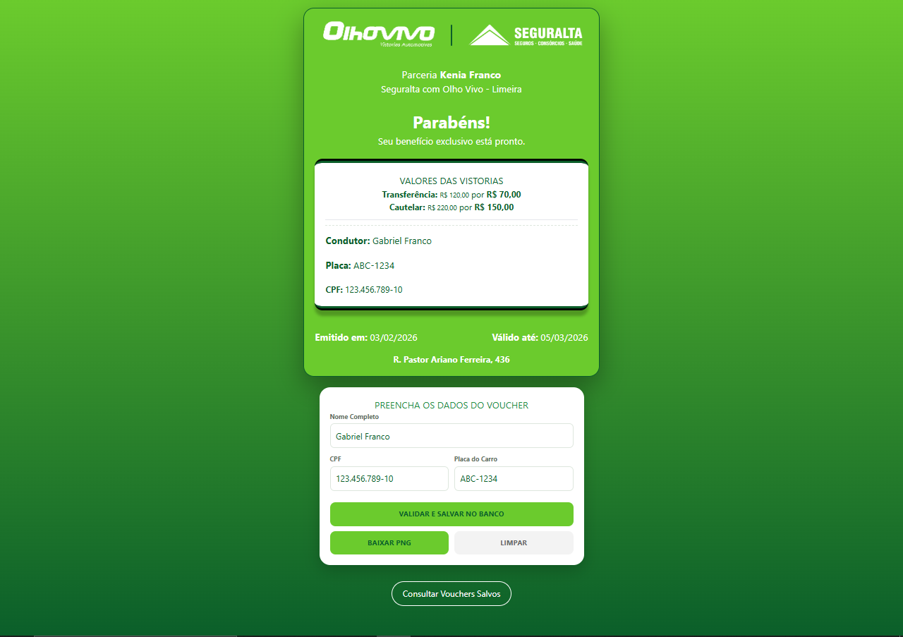
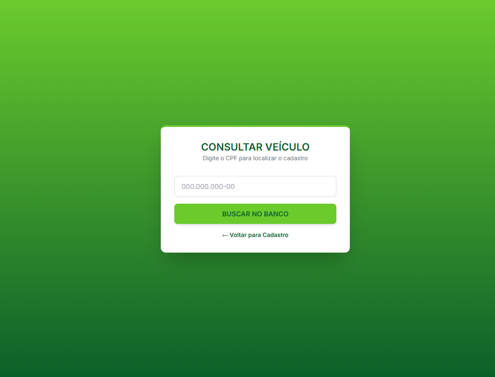

# 🎫 VoucherGen — Sistema de Gestão de Benefícios (Corretora de Seguras & Vistorias Veicular)

Este projeto foi desenvolvido para automatizar e validar a concessão de descontos exclusivos na parceria entre a **Kenia Franco Corretora de Seguros** e a **Olho Vivo Vistorias (Limeira)**. A solução permite a geração de vouchers personalizados e um sistema de conferência digital para garantir a autenticidade dos benefícios.

---

## 🚀 O que a Solução Resolve?

O sistema foi criado para substituir processos manuais por uma ferramenta digital que garante:
* **Personalização Dinâmica:** Vouchers contendo Nome, CPF e Placa do veículo do cliente.
* **Segurança na Validação:** Sistema de consulta em tempo real para impedir o uso de vouchers falsificados.
* **Praticidade de Entrega:** Geração de arquivo de imagem (PNG) pronto para envio imediato via WhatsApp.
* **Gestão de Dados:** Controle de atendimentos realizados e limpeza automática de registros.

---

## 🛠️ Stack Tecnológica

* **Frontend:** HTML5, CSS3 e JavaScript (ES6+).
* **Processamento de Imagem:** [html2canvas](https://html2canvas.hertzen.com/) para converter elementos DOM em imagens PNG.
* **Backend & Database:** [Google Firebase](https://firebase.google.com/) (Realtime Database) para armazenamento e consulta instantânea.

---

## ⚙️ Funcionalidades

### 🖋️ Painel de Emissão (Lado da Kenia Franco Corretora)
* **Preenchimento Automático:** Enquanto a corretora digita os dados no formulário, o design do voucher é atualizado instantaneamente na tela.
* **Integração com Banco de Dados:** Ao finalizar o preenchimento, os dados são salvos no Firebase.
* **Exportação de Imagem:** Um botão dedicado utiliza a biblioteca Canvas para capturar apenas a seção do voucher e gerar um arquivo PNG personalizado.

### 🔍 Painel de Validação (Lado da Olho Vivo Vistoria - Limeira)
* **Consulta por CPF:** O funcionário da vistoria realiza a busca pelo CPF para confirmar se o cliente possui um cadastro ativo no sistema.
* **Check-in de Atendimento:** Após validar as informações, o funcionário marca o cliente como atendido.
* **Limpeza Automática (Cleanup):** O sistema remove o registro do banco de dados 24 horas após o atendimento, permitindo que o cliente possa gerar novos benefícios no futuro para outros veículos.

---

## 📐 Arquitetura do Fluxo

| Emissão do Voucher | Consulta do Veículo |
| :---: | :---: |
|  |  |

